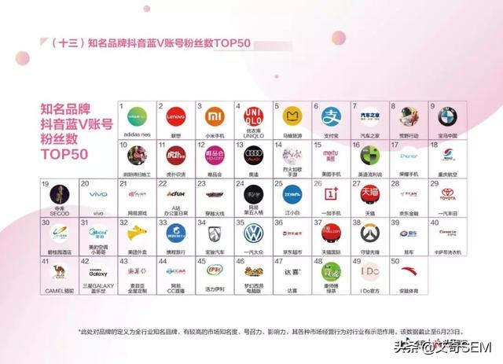
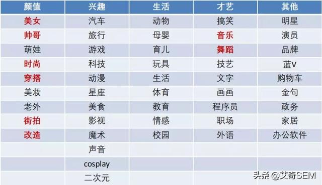

# 抖音蓝V 运营全攻略，教你玩转抖音企业号

> 此文章原文出自[今日头条](https://www.toutiao.com/a6672530992600711687/?tt_from=mobile_qq&utm_campaign=client_share&timestamp=1557664397&app=news_article&utm_source=mobile_qq&utm_medium=toutiao_ios&req_id=201905122033160100230390389956FC3&group_id=6672530992600711687), 仅用于学习

## 前 言

不知道你有没有发现？18-19年的抖音企业营销需求增长，跟14-15年的微信公众号的疯狂增长有着惊人的相似？

变的是平台，不变的是那一群人。

当年，能把公众号运营的风生水起的企业，现在玩抖音基本上也照样赚的盆满钵满，而当年那些眼红别人都做了公众号，自己不懂也想做，最后运营到今天，粉丝量和阅读量仍不超过三位数的企业主们，现在依然纷纷出动——花600块开个抖音企业号认证，一年花几万块请个抖音小白来运营。

今天拍个门头、明天拍个产品、后天发点鸡汤，然后幻想着点赞数个位的抖音号给自己大量导流、加爆微信、每天爆单、数钱到手软？兄dei，花钱骗自己好玩吗？

虽然这篇文章确实是在帮助大多数企业快速入门抖音蓝V的运营，但是，不得不遗憾的说：大多数企业是真没必要砸钱在抖音上。

原因很简单：当年的微信公众号，说白了，主要就是文案+图片的二维游戏，而现在的抖音，是文案+图片+音频+视频的四维游戏了。

话说，俄罗斯方块，您都没玩明白，王者荣耀，您觉得能撑到几级？而且还学别人动不动就买皮肤、买装备？省下那万八千的，投点啥广告不好呢？

看完这一篇，该醒的赶紧醒醒，该干的赶紧行动吧！

## 【浏览目录】

一、必须get的六道送命题

二、包装&定位

三、运营之道

四、内容制作

五、涨粉野路子

六、避坑指南

### 一、必须get的六道送命题

#### 第一、做抖音的营销本质是什么？

抢流量？抢定位？还是抢关注量？其实都不是，做抖音营销，`其本质是抢占用户的时间`。一个用户，能愿意在哪个抖音号里逗留更长时间，也就创造了更大的留存率、转化率等。

对比下公众号和抖音，就会发现，历史的规律总在重复上演：一个普通粉丝从关注了几个公众号，到几十、上百个号，最终有一天清理掉所有他不愿再看的公众号。而抖音呢？

虽然系统会提示、会推荐，可是，当有一天，每一个已经不知不觉关注了几百上千个抖音号的粉丝，都会因为厌烦海量推荐，以及无力消化冗余的信沉淀息，必将再次重复上述操作。

而今天做抖音号的你，有信心让你的粉丝在未来留下来吗？

所以说到底，`用户愿意花多少时间在你这，与你为用户创造的价值成正比。`

#### 第二、实现抖音变现的正确顺序？

涨粉（拉新）→引流（沉淀）→养熟（信任）→变现（赚钱），这才是正确实现商业价值的顺序，很多人抱怨抖音上引流困难、赚不到钱，很多是因为连最基本的顺序都没搞清而已，一上来就只会问“怎么变现？”、“怎么还没看到收益啊？”碰上这样的客户/老板，你si不si啊？？

而为什么要树立强大的个人IP，目的也是为了拉近与粉丝的距离，缩短变现链条，将建立信任这一环直接放到过硬的作品中实现。最终，不论是通过平台内的电商橱窗，还是引流到微信、微博后，转化、变现的速度都会更快。

#### 第三、想加点炫酷的特效，又学不完复杂的AE教程，怎么破？

说实话，如果不是专门玩技术流的抖音玩家，只要掌握一些常见的特效手法就足够用了。目前国内的短视频营销，基本上还轮不到人人都要拼特技的地步，更不需要你非得学完所有的AE特效才能动手。一句话，多做事，少空想！

而想用AE做的很精，没有几年功夫真的很难，大部分人都是套模板罢了。如果希望视频做的专业点，手段多元化一点，建议直接上手PR，最快一周即可出师，而不要依赖于会声会影、爱剪辑等小白级的软件，对于上升空间有一定限制。

#### 第四、中小微型企业的抖音运营团队怎么搭建？

团队搭建这件事，最核心的还是取决于每家公司的预算，所以，根据职能分工和人员数量，大致可以给到以下参考：

预算只够招一个人，那么需要这个人同时负责：拍摄、剪辑、编剧、出镜、化妆、运营等。

预算够招两个人，大致分工是：一个负责拍摄和剪辑，另一个负责编剧、出镜、化妆和运营。

预算够招三个人，大致分工是：一个负责拍摄和剪辑，一个负责化妆和出镜，另一个编剧和运营。以此类推。

以场景式表演为主的运营团队，则还会涉及到群演、服化道工作人员等多方配合，预算则更高。以下这份费用拆解表仅供参考。

除此之外，还有非常重要的一点，就是在挑选出镜演员上，如果是准备以她为核心去打造出个人IP性质的抖音企业号，那么，一定一定要在开始前就与其签订有约束力的“合同”。以防其被捧红后，擅自辞职单飞或身价倍增为要挟公司，提出各种过分要求等，对公司造成不必要的损失。

举一个出名的例子。知名大号“七舅脑爷”里早起扮演七舅脑爷的女友的演员本身只是这个项目的编剧（左图中女子），公司当时只与七舅脑爷签了经纪约，但与这个经常出镜的“配角”只签了普通的劳动合同而已。

后来这个号大火了，这个妹子开始各种提要求，搞事情，闹到最后单飞了，导致现在七舅脑爷换了右图中女子做PC搭档。这对于做情侣档定位的账号来说，影响还是蛮大的。

所以，不要随便拉个长相还行的前台或助理就来当IP出镜，第一要看的是才华，其次是颜值，确定好人选后，就要协商好未来的发展规划和利益分配，不能压榨也不能被坑。

#### 第五、怎么挑选靠谱的抖音运营培训班、抖音代运营公司？

牢记最重要一句口诀：离开内容谈培训的，都是在收智商税。

随着抖音的流量红利期兴起，市面上各种收费的抖音培训班、训练营、论坛峰会等也如雨后春笋般涌出，然而，据小编观察，相当一部分都是属于“鸡肋型”的“圈钱选手”。

看其目录，超过一半的内容都在讲行业趋势、涨粉套路、变现手段之类的，而剧本怎么创作？拍摄技巧有哪些？演员怎么表现？视频怎么剪等内容创作部分，都是只言片语，一笔带过。

试问，如果你能把视频做到高赞，还愁涨粉、变现的问题吗？你会需要听这类课吗？反过来说，难道掌握趋势、精通变现，对于拍好每一个作品有着什么直接的帮助吗？

而选择代运营公司，可能是另一个大坑了。同样是运营出一个爆款大号，如果是有能力自营出来，未来的利润空间可比代运营赚的年费多太多了。

所以，有实力自己打造网红的，大部分都在做MCN，或者网红经济公司，而真正能帮甲方做出业绩的抖音蓝V代运营机构，收费基本上也不可能太低。

那么，如何挑选靠谱的抖音运营培训班、抖音代运营公司呢？

1、看其以往成绩、查其客户口碑、作品质量；

2、花在内容创作上的投入占比有多大；

3、与其找“来者不拒，行行精通，给钱就上”的培训/代运营公司，不如找“不好意思，我们主做这几个行业“的垂直领域机构。

#### 第六、上热门最快的方式是刷粉刷赞刷评论？

如果是从速度角度来回答，答案是yes，但如果是从账号安全角度考虑的话，答案是NO。

关于刷量，市面上主要有2种，一种是机刷，直接充值即可操作，单价低，操作快，见效快，缺点是很容易被平台检测到，虽然不会导致封号，但会影响权重，后续推送官方少给或不给推荐量，直至沦为死号；

另一种是人工刷，也就是大批量真人水军以兼职的形式，拿钱办事，按雇主的要求，完成指定操作。

优点是行为模拟真实增长，不易被平台检测，缺点是单价高，速度慢，且真实资源极少，在市面上冒充人工刷的太多了，如果不是知根知底，或者熟人介绍的话，操作完一次，把自家账号作死的大有人在。

想上热门，科学的打开方式有多种，刷量只是最投机取巧的一种。我们常用的方法有如下几条：

1.蹭热度：根据每日的抖音热搜榜，找合适自己品牌调性的作品，以合拍、模仿、二次创作等形式蹭其热度。

2.反差法：在情理之中，做很反差的事。比如：用吃西餐的范儿吃火锅，阿纯的瞬间变身、另类套垃圾袋等。

3.争议法：将某件很有争议的事客观的记录下来，让粉丝在评论区发表看法，效果往往很炸，上热门嗖嗖的。

4.炫酷法：基本上，作品中出现了绝美的风景、惊叹的技艺、炫酷的黑科技、颜值超高的小姐姐小哥哥等元素，高赞的概率都是很高的，再加点出乎意料的创意，上热门也不难。

5.共鸣法：将日常生活中大家都经历过，且普世性较高的事，用另类或创意的方式呈现出来，效果也是Amazing！案例参考：多余和毛毛姐的作品中，这类手法较为常见。

### 二、包装&定位
一个包装到位的账号，对于引导关注、树立品牌形象至关重要，运营许久的你，账号的包装真的到位了吗？来一一对照下吧！

头图：这张顶部的图，不论是对于蓝V还是普通抖音号，最重要的作用只有一个：引流。不管你是用简单粗暴的指引还是福利诱惑，引导关注，是这张头图的第一使命。如果你只是用来做个无意义展示，我只能遗憾的说：浪费资源。

头像：因为是默认圆形的，所以如果logo本身不适配，请最好调整下再上传。

账号名：账号名不要太长，不要太官方。在抖音蓝V粉丝Top50中，没有一个名字是超过7个字的；英文可以不加就尽量别加；不是很有必要的话，后缀就别写XX公司/企业。

个性签名：在这一块抖音蓝V大部分都是用来介绍账号，极少会加入微信号，虽然会显得有点low。但个性签名的使命也只有2项：价值最大化的介绍账号和站外引流。

引流窗口：官网、联系方式、商品橱窗等都可以统称为引流窗口，前两者是先引流后变现，后者是为了直接变现。前两者就没什么说了，有就甩上去。

商品橱窗就说一点，目前大部分在抖音上能卖的好，大多是价格不高的产品，对于像高档家具、家装设计、车房船名、医美整容等高价商品，如果要利用好商品橱窗，一般是先放一个单价较低的虚拟引流产品，引导粉丝先购买，取得初步信任后再进一步引导到正价产品上进行转化。这招跟预售是一个道理，目的是为了锁定意向。

POI：即门店唯一地址，是帮助企业精准引流的最佳工具之一。每个抖音企业号一次最多可认领10个POI，做实体店的企业号绝对不能浪费这个功能。

ps：若您的门店众多，需一次性大批量认领（大于10个），点击【快速认领大批量门店入口】-【下载模板】，打开模板excel，进行操作。

置顶：这是认证抖音个人号和抖音蓝V才有的功能，毫无疑问，每个运营者必然会置顶自己认为最重要的三个作品。一般来说，最好选择让自己显得专业、权威、可信度高的作品来置顶，从而提高关注率。例如，李佳琦的三个置顶作品可以作为参考：

一个是其破了吉尼斯涂口红记录；一个是和马云PK直播卖口红，战胜马云；一个是和韩国女演员在后台的互动，女演员的那句“oh my god”似乎在暗示李佳琦已经红到了韩国。三个视频都是从各角度为其提供权威的信任背书，让“口红一哥”这个IP得到强化。

*关注：仔细观察下那些专业做抖音矩阵的大号，就会发现，他们要么一个都不关注，或者关注的都是跟自己有关联的号。

这一点也很重要，如果自家公司有其他蓝V号或个人号需要引流，则可以互相关注导流；但如果没有，请把关注了的其他不相干的账号转移到另一个抖音小号上，不要把自己辛苦做起来的流量导给了别人。

永远别忘了前面“送命题”的第一道：每一个用户的每天刷抖音的时间如果是恒定的，但通过你的关注，他也关注了别的无关账号，也就意味着你容许别人与你分享用户的时间，那么你的流量池。。

账号包装好之后，需要考虑的就是发什么内容，也就是定位方面的问题了，它会决定你获取粉丝的精准度，对应影响该账号的变现能力。

目前抖音平台上的短视频类型主要有 48 种，分别为：

类型很明确，问题也很明显——同质化现象明显，对企业和个人来说，要想在平台脱颖而出，最重要的解决方法，是向用户提供有需求的差异化价值，实现差异化定位，这里给出一个亲测好用的万能定位公式：

定位=表现形式+类型+类目

具体的使用方法，即围绕这个表格的不同模板内容进行组合使用，例如“真人上镜+评测+美妆”这个组合，对应的典型大号就有：680W 粉丝的“老爸评测”，654W 粉丝的“颜九”。

诸如此类的例子还有很多。这个万能公式很好用，但对大多数小伙伴来说，实际使用起来还是会觉得相对抽象，建议大家可以再找一些相关类型的视频作为辅助参考。

也可以利用热门排行榜，把目标类目的前 10-20 的号主都看一遍，选择和自己要做的方向切合的抖音号作为对标账号，再对其数据进行分析，选择合适的内容进行模仿或翻拍。

### 三、运营之道
1. 打造优质蓝V号的五维法则

2. C-MAD运营法：

【C：创作 Creation】

5S必现原则：5秒时长内的视频素材大概率决定浏览者是否有更高的兴趣、互动度以及分享意愿。建议在视频前5秒即出现核心“梗”，即主题、用意、人物、景色、美食、预告等。

3H内容原则：基于品牌用户在内容营销上的整体规划，可从三个方面入手，热点型内容、标签型内容、广告型内容，归纳为3H内容规划原则。

3E创作原则：短视频内容消费者的往往对简单易懂的内容更感兴趣，所以短视频内容的创作还需要坚持易聚焦、易理解、易互动三个原则。

1）易聚焦：一个作品表达一个核心信息点，让用户更聚焦在内容本身，避免多个不同重点出现导致用户焦点模糊。

2）易理解：作品叙事简单清晰，让用户以最低的成本，在最短的时间内理解视频内容，避免内容太难懂。

3）易互动：吸引互动时，降低互动门槛，缩短互动路径，比如希望用户模仿舞蹈动作时，动作尽量简单易模仿。

【M：运营 Managemengt】

发布前（选择发布时间）：不少创作者关注抖音作品何时发布问题，跟进“头条指数”研究，从大盘数据看，视频发布的时间和视频播放量之间并无显著的相关性。真正影响推送后的播放量的指标，还是粉丝基数。

发布时，第一印象原则：制作封面时，建议出现核心信息点，让封面“言之有物”，比如出现关键人物、表情、动作、道具等，通过封面的视觉冲击，吸引用户观看。

文案三要素：

#：通过#可参与到平台不同的主题板块，增加视频展示机会，注意：#内容需要与视频有高度相关度。

@：通过@可以隔空呼叫其他任意账号，和不同的账号间产生互动，提升视频互动度。

字：文案文字建议言简意赅并注意平台特有的语言文化，如“据说发第二遍会火”等。

发布后，冷启动运营四要素：

【A：借势 Advantage】

借势方式一：热搜、榜单、指数等，都是了解抖音平台当下热点的公开渠道，巧妙借助热点，融入到内容创作中，往往有可能获得更大流量。

借势方式二：参加热门挑战赛、使用热门音乐和明星达人进行互动合拍等，都可以加大获取流量的概率。

【D：数据 Data】

通过大数据中各类热词的指数变化，以及搜索频次，可以更精准、更迅速的打造出爆款视频。这里分享两个数据工具，分别为:

卡思数据：https://www.caasdata.com/飞瓜数据：http://dsp.xiguaji.com/

来源：卡思数据

来源：飞瓜数据

3. 抖音矩阵关联的方法：

A.两个IP合拍视频

B.关注中只留矩阵的账号

C.标题中@矩阵账号

E.评论中@矩阵账号

F.个性签名引导

### 四、内容制作
先上一个较复杂的抖音作品的创作流程：

1、打个草稿，写出一个故事梗概，然后写出剧本草稿；

2、提炼台词，勾勒细节；书面语改口语；检查逻辑是否通顺、内容是否通俗易懂，所有要表达的点是否都已体现等；

3、试拍几遍，找找感觉，然后填写脚本拍摄模板，开始加入背景音乐、字幕、道具、特效等需要的元素；

4、按照成形的脚本拍几遍完整流程。再根据实际效果调整节奏、声音、动作、台词、音乐、特效等要素；

5、精细化的打磨细节：优化逻辑、校准节奏、字幕美化、转场衔接等。

6、成品测试，发给若干朋友看，测试点赞率、评论率、完播率，根据反馈进行调整，直至没问题后即可上传推送。

对于短视频的内容制作，简单的归纳起来就是四个字：写、演、拍、剪，连起来就是“斜眼派件”，形象生动的画面是不是更容易记住？下面我们分开讲解。

1. 写——脚本创作

创作前牢记爆款抖音创作的六大核心要素：内容紧凑、颜值才艺，生活化内容，魔性音乐，特效创意，IP出镜。

一份脚本创作，包含了剧本和标题（文案描述）两个部分。

基于前面提到的“5S必现原则”，我们知道，在剧本创作时，一定要习惯把核心要点或者需要表达的诉求放在前面，即使是配音音乐搞悬疑和反转类型的，起码也要在标题上让大家有继续看下去的欲望，不然，早已习惯了快速刷抖音的用户，是没那个耐心等着整个作品放完的。

2. 演——镜前表演

挑选合适的短视频出镜演员要求有很多，但最基本的看3点：

◆ 放得开，不拘谨，镜前表演较自然，不做作。

◆ 有一技之长。要么唱得好、跳的好，要么能说会道，专业有才，如果啥都不会，最起码颜值在线、有个性，对着稿子念也照样吸粉。

◆ 懂得配合。演员不精通剪辑没有关系（虽然演和剪最好是同一个人），但最起码懂得配合摄影师的拍摄，学会卡点、配BGM等基本操作，可以让出品更有效率。

3. 拍——视频拍摄

很多刚入门的玩家都是习惯一镜到底的拍摄，拍完就加点特效就直接推送了。不得不说，这样简单的视频想火真的就要拼硬核内容了。想让视频变得精致、有趣、与众不同，学会分镜、转场、运镜、卡点等对于出品效果至关重要。

一般在室内拍摄，如果演员的动作幅度不太大的话，以下器材就可以满足：三脚架、手机支架、自拍杆、补光灯、柔光灯、电容麦等。

在光线充足的情况下，用手机和单反的效果不会差太大，选单反，除了追求画质高清之外，最看中的就是2点：防抖和背景虚化，但对于大多数人，用自己的手机基本上就够了。

如果是应对动作幅度比较大的拍摄会用到以下器材：稳定器、gopro运动相机、无线麦克风（小蜜蜂话筒）等。

4. 剪——后期剪辑

如果不考虑精致的封面、细腻的转场和炫酷的特效，用抖音自带的剪辑器一般也够用了，里面包含的花样道具、海量音乐库、时光倒流 重读等特效工具、多种滤镜等等其实很不错的。如果需要一些额外辅助，手机上的一些剪辑器也可以满足。

例如：巧影（擅长特效效果）、快影（可快速生成字幕）、一闪（适合安卓机，音乐库分类明确、品质高）、Cute Cut（可做细化效果）。

但对于一些对画质、后期和特效要求比较高的账号来说，手机上那点功能是远远不能满足的，所以会用到PC端的一些视频剪辑器。例如：Adobe Pr 、Filmora（万兴神剪手）、Final cut Pro（只适用于苹果系统）。

五、涨粉野路子
对于大部分人来说，在初期起量的过程中，都是相对“煎熬”的，在这里分享 4 个实用的涨粉“野路子”。需要另外提一下的是，“野路子”虽好用，但不能贪长久，后期要想把账号运营好，主要靠的还是优质内容的支撑。

1、导流涨粉

在分享第一个快速涨粉方法之前，需要大家先明确一个观点：粉丝是静态、流量是动态。

意思就是，在固定平台上，粉丝的出现，说明他们只是单纯进行了“关注”的选择，这是“静态”的；而当这些粉丝在不同的平台上进行“游走”，他们获得了更多选择，可以“动态”地去抉择，要不要到其他平台上去关注你。

对应的启发，就是我们可以通过除抖音外的其他平台进行倒流，“其他平台”这里特指头条系，如火山小视频、悟空问答、西瓜视频、头条号。

可以在这些平台上发布同类型视频甚至是在同类型视频的博主下评论留言：“更多/完整版视频请关注我的抖音号 xxxxx 之类”等；

这里要注意一点是，尽量寻找垂直类目的账号。

2、移花接木

这个涨粉方法，对应最典型的例子是去年的“小甜甜”事件，在她本人账号一夜涨粉 480W+ 的同时，同名同头像、并且是男性的账号，粉丝量最多的，也能达到 34W+。

所以当抖音平台有人因为某个事件爆火之后，不妨可以尝试下“狸猫换太子”，把自己的头像和名字改成爆火类型的账号。

使用这个方法有个前提，就是要求这个账号是新号或杂号，想要达到更好的效果，还可以通过上传相关人物的视频营造假象做铺垫，当热度过后再悄悄换回来，或者是改成你准备做的方向的内容；

以抖音的特性，取关率一般不会太高，后期通过优质内容弥补和维护，还是能够弥补回来的，需要注意的是，内容相关性不要差太远。

3、热门视频诱导性评论

玩抖音除了善用人流量较大地标、BGM、@抖音小助手、互动反差标题、善用热门话题这些辅助内容外，还有一个时常被忽视的涨粉小技巧，即善用评论区。

可以在热门视频的评论区进行评论，实现导粉，注意不是单纯地留微信号。

一般评论的内容，可以是根据视频内容有感而发，尽量往走心、搞笑、产生共鸣等方向走，当然还要带有一定的诱导性，可以参照上图的例子。

PS：此时你的昵称将成为引流的关键，例如你是做职场号的，昵称可以改为“职场干货”，有这方面需求的粉丝自然想着关注一下。

4、蹭热门视频涨粉

无论是公众号还是抖音，蹭热点涨粉，总会有立竿见影的效果。同样的，我们还可以通过转化热门视频的表现形式，如翻译、抢镜、模仿、集锦、图文、字幕跳动等等。

六、避坑指南
1.多想着创造价值，少生产内容垃圾，多一点真诚，粉丝更愿意常看。

2.无论预算如何，团队尽量保持精简、设备尽量轻资产化、人员尽量能力综合化。

3.目光放长远，要能看到至少未来3-6个月的市场中，你在哪？

4.至少保持平均每周2—4次更新，有实力最好做日更。

5.求精不求多，宁慢不要快，用心做每一个作品。

6.内容占比：平均10个视频中，5个做知识点科普，3个做蹭热点品牌曝光，2个用创意包装软广。

7.黄金发布时间：周一到周五：上午8点（早高峰），中午12点（午休），下午6点（晚高峰），晚上21点、22点（最放松的娱乐时间）；周六到周末上午11点（睡完懒觉刚起床），晚上21点、22点起（正常嗨起来的时间点）。

8.主播语速要稍快或录完后将视频节奏调快，因为抖友早已习惯了快节奏的浏览，慢吞吞的开场和语速，必然会造成一定的流量流失。

9.出镜主播尽量找颜值高。因为抖音从一开始就是走的高颜值、高逼格路线，粉丝已经习惯了关注颜值高的。别总想着做第二个李雪琴，很多成功不可复制。

10.视频里最好埋下可以落地引流的“钩子”，也就是“抖友福利”：能用电子版资料就不用实物礼品，要用实物礼品至少留下联系方式，送服务体验的必定到店领取。

11.粉丝没大涨，作品没出爆款前，最好别发广告视频。道理很简单，鱼塘都没建多大，鱼苗儿没撒几根，你能指望捞上几网大鱼？所以顺序很重要，建好鱼塘，先养鱼，才能捞鱼。急功近利，等于杀鸡取卵。

12.想持续走红，要不断生产新梗新作品。就像餐厅隔两三个月就要更新下菜单一样，不然老顾客都吃腻跑光了。

13.永远别迷信什么万能爆火公式，什么听完就分分钟获赞百万的课，就像没有万能神药能包治百病一样。

14.抖音企业号要做出属于自己的风格，其实就是企业人格化，像每一个活生生的用户一样，都是有喜怒哀乐的性格和特定基因的，越是鲜活的、接地气的“企业性格”，越是能引发用户关注。例如：小米手机的抖音企业号中，基本上雷军出镜的作品就是比账号中其他真人出镜的作品的各项数据都更高。

15.目前抖音企业蓝V账户分布在27个行业，从占比上看，互联网、服装、美食、文化旅游等行业占比排在前列，契合大众衣食住行玩等领域的需求。想做大众行业，作品一定要玩出花样，才能出奇制胜；但选择细分领域，另辟赛道也是不错的选择。

编 后语

以上就是一些抖音企业号在运营时常用的技巧和注意事项，也是很多线下付费课里的“精华”。

然而，这些都可以逐渐成为标准化的东西，付费的价值也会慢慢降低，用心把本文多看几遍也就开窍了。真正难的就是那些可以通过自由组合，营造出千变万化的效果的东西，这些永远都是非标准化的内容，每个人都可以学会一个个的知识点，可最后做出来的效果却千差万别，区别就在是否有悟性，是够用了心。